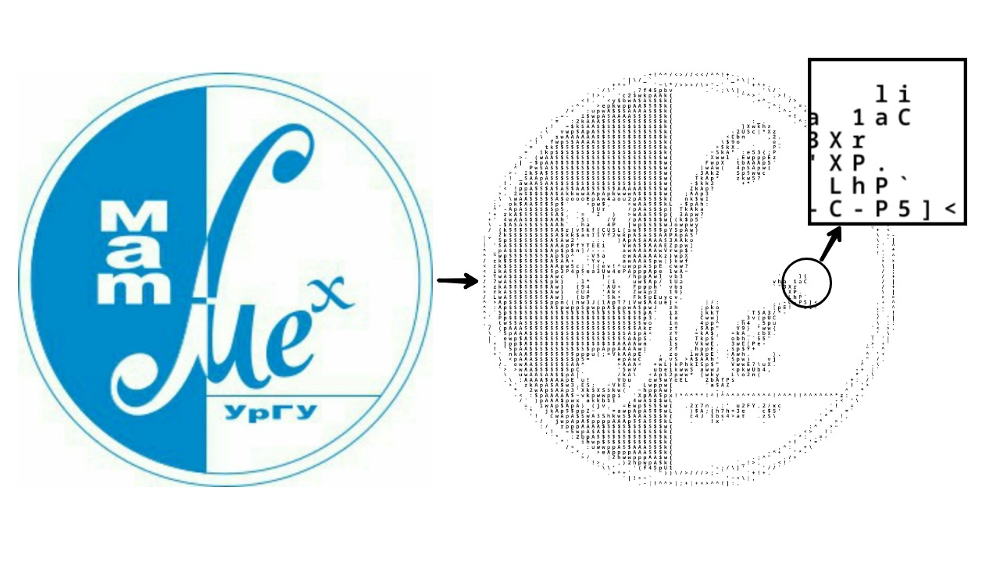
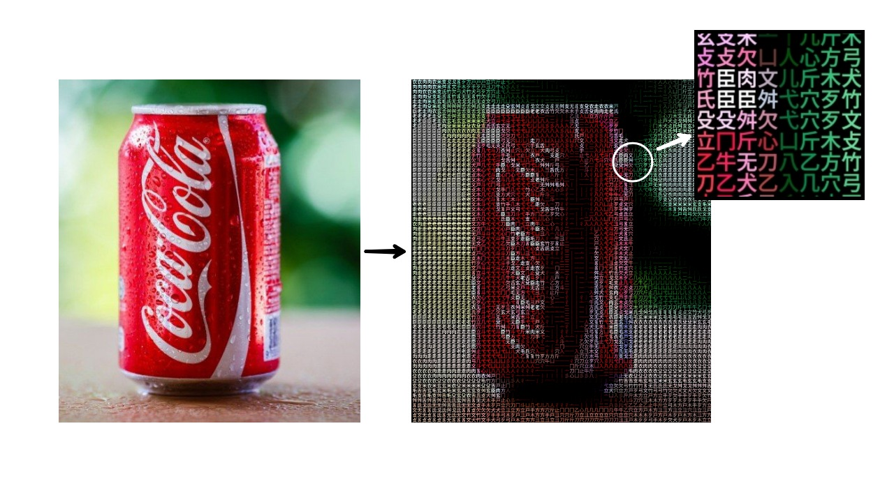

# ASCII artist telegram bot

[ASCII artist](https://t.me/ascii_artist_bot) - это телеграмм бот, 
который делает ascii арты из картинок.

Обычный режим обработки

Режим true color

## Основные функции
Бот умеет превращать в ascii арты картинки и видео. Есть два режима обработки, 
можно создавать как классические, так и цветные арты.

При обработке можно настроить детали:
- Количество символов по вертикали
- Цвет фона
- Цвет шрифта
- Символы из которых будет создаваться арт (можно прислать свои или 
использовать готовые наборы)

## Команды админа
Для админа доступны следующие команды по получению статистики:
- Количество пользователей
- Топ активных пользователей
- Среднее количество обработанных фото и видео на пользователя
- Статистика конкретного пользователя по @username

## Реклама в боте
У админа есть возможность добавлять в бота рекламу с помощью команд.
Реклама - это одно сообщение, которое отправляется пользователю после 
обработки очередного ascii арта. Рекламное сообщение может включать текст, 
картинки, видео и ссылки. Админ может настраивать как часто реклама будет 
показываться пользователю (например раз в 3 обработки).

Для рекламодателя и админа доступны команды:
- Вывести рекламное сообщение (чтобы посмотреть как оно будет выглядеть для пользователя)
- Показать статистику: общее и среднее количество показов рекламы
- Показать статистику для конкретного пользователя по @username

Если в бота добавлены несколько реклам, они будут показываться по кругу

## Алгоритм создания артов
Проект - это не только телеграмм бот, но и сам алгоритм создания ascii артов. 
Использование библиотек для создания ascii артов не дает такого качества и 
возможностей детальной настройки как мой алгоритм, который получился очень 
проработанным. 

## Контакты

- telegram: [@VladimirApter](https://t.me/VladimirApter)
- email: [vova.apter@yandex.ru](mailto:vova.apter@yandex.ru)

ascii_artist_tg_bot 2024.